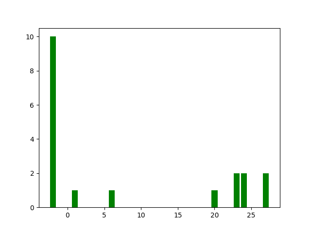
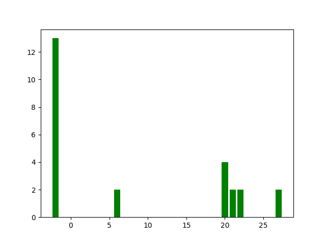
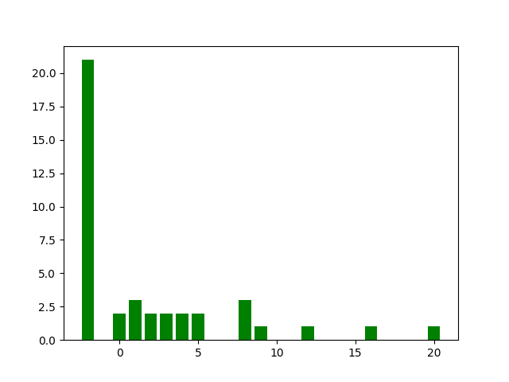
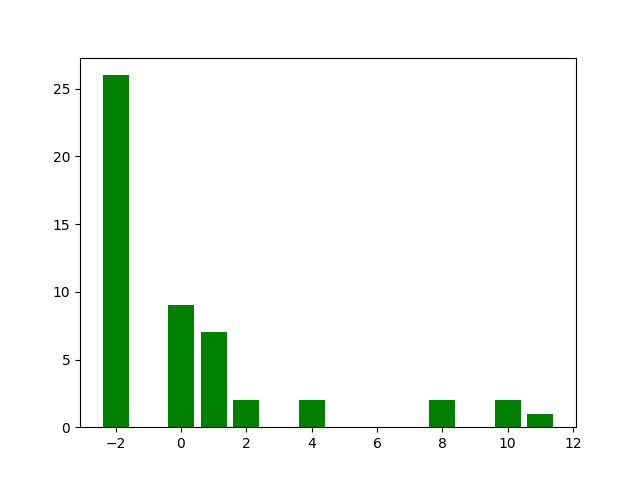
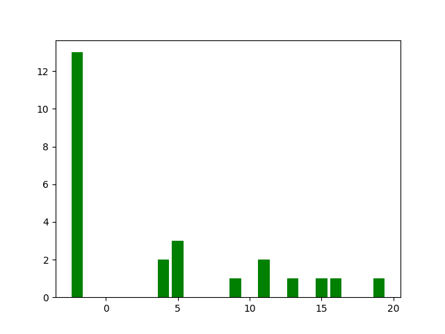
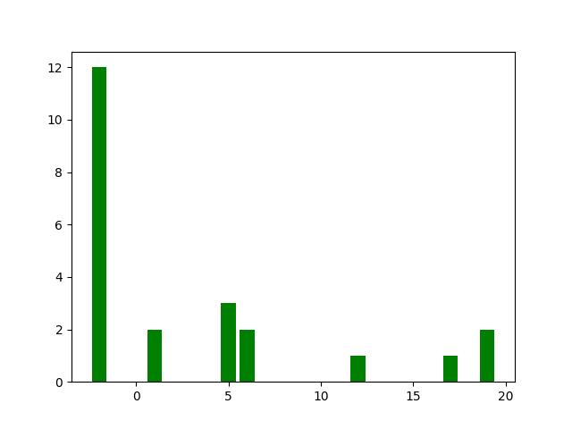
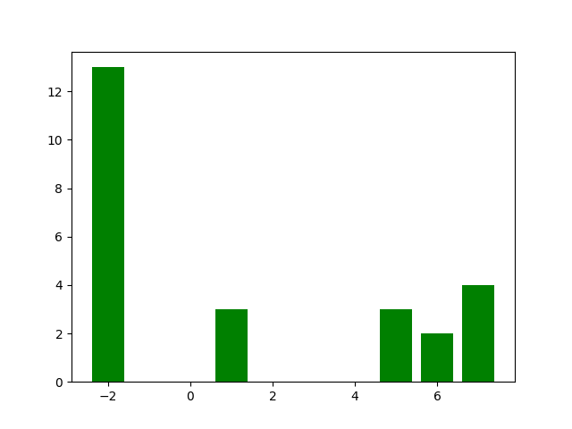
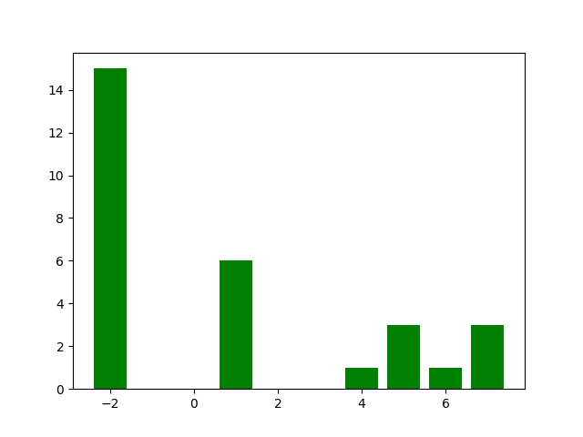

## Readme

<<<<<<< HEAD
#### Feature Histogram

Right images are the baseline splitting feature histogram, and the right are RL tree.

Index -2 represents the leaf node.

It is not true that the RL tree uses much more feature than baseline CART tree.

* breast_cancer

<figure class="half">
    
    
</figure>

* german

<figure class="half">
    
    
</figure>

* heart

<figure class="half">
    
    
</figure>

* pima

<figure class="half">
    
    
</figure>

#### A New Tree Policy Network

Inspired by Tree-LSTM.

Policy Network: $F$
Inputs: Node Embedding $x$, Parent's Topology Embedding: $h_p$
Outputs: Action $a$, Topology Embedding: $h_{true},h_{false}$
$$
h_{true},h_{false},a = F(x,\hat{h_p})
$$
=======
#### Reinforce Learning Decision Tree

In general, decision tree is learnt in a top down greedy fashion where, at each node, a split rule is learnt by minimizing some objective function. However, the training data could be noised or the data feature are entangled with each other. That‘s why decision trees are less promising working on large datasets.

At the same time, the decision tree learning could be viewed as a reinforce learning process. Actions are the  splitting operation, environment and states are tree nodes and their data set, the rewards are given by the performance of the whole decision tree.[Learning Decision Trees with Reinforcement](http://metalearning.ml/2017/papers/metalearn17_xiong.pdf)

By optimizing the final performance rather than the greedily each node's information entropy gain, we may get a decision tree with better generalization ability and robustness.

#### Experiments

I just reproduce the their work.

| Datasets     | breast cancer | german   | heart    | pima     |
| ------------ | ------------- | -------- | -------- | -------- |
| Baseline Acc | 0.951468      | 0.680533 | 0.824123 | 0.790916 |
| RL Acc       | 0.958176      | 0.754933 | 0.842543 | 0.814397 |

Their results are exciting, and I and working on more experiments about the robustness of the RL decision tree. That includes:

1. Adversarial Attack [Robust Decision Trees Against Adversarial Examples](https://arxiv.org/abs/1902.10660) 
2. Label noise [On the Robustness of Decision Tree Learning under Label Noise](https://arxiv.org/abs/1605.06296)
3. Data Poisoning [Proving Data-Poisoning Robustness in Decision Trees](https://arxiv.org/pdf/1912.00981.pdf)
>>>>>>> refs/remotes/origin/master
